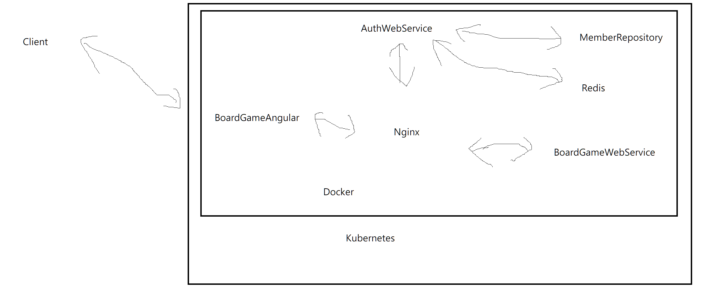

# 專案介紹
## 架構說明
	專案架構: 微服務架構
	前端: Angular
	Gateway: Ocelot
	後端: .Net Core
	後端Api業務: Auth(用戶語認證授權)、Lobby(大廳遊戲房間)、Game(遊戲邏輯)
	資料庫: MSSQL資料庫，Game(遊戲)、Member(用戶)
	Redis:儲存遊戲房間跟遊戲狀態的3主3從叢集Redis，還有附加哨兵模式
	Log: 使用NLog發送至ELK(Elasticsearch、Kibana)。

## 檔案結構
	src┬ApiGateways-OcelotApiGateway
	   ├Services┬Game-GameWebService
	   │		├AuthWebService
	   │		└LobbyWebService
	   ├WebUI-BoardGameAngular
	   ├Respositories
	   └Common

# Getting started
## Docker Compose
完整全部執行 docker-compose up --build -d
部分執行 docker-compose -f redis.yml -f elk.yml up --build -d

## EF 資料庫 Migrations
board-game-member-db
1. 在啟動docker-compose後，連上資料庫localhost,1487，以SA帳號登入
2. 接著新增資料庫Member
3. 新增登入User ID=AuthWebService Password=auth$WebService 對應Member 預設資料庫Member 不強制執行密碼過期
4. 資料庫Member設置AuthWebService權限，參考 需要資料庫權限
5. 在VS起始專案設為AuthWebService，套件管理器主控台預設專案設為MemberRepository
6. 在套件管理器主控台輸入 Update-Database -Context MemberContext

### 套件
Microsoft.EntityFrameworkCore
Microsoft.EntityFrameworkCore.SqlServer
https://dotblogs.com.tw/abc12207/2018/03/24/entity-framework-core-migrations-at-separate-class-library-project

### 需要資料庫權限
刪除
改變任何結構描述
更新
建立資料表
參考
插入
選取

### 指令
啟用
Enable-migrations

[變更名稱] 為資料庫變更的命名，自訂
[資料庫] 使用的DbContext，自訂，此範例是MemberContext
[輸出路徑] 應用程式專案下輸出Migrations的相對路徑，例如 Out/Migrations

加入變更
Add-Migration [變更名稱] -Context [資料庫]
Add-Migration [變更名稱] -Context [資料庫] -OutputDir [輸出路徑]

更新變更
Update-Database [變更名稱] -Context [資料庫]
Update-Database -Context [資料庫]
-Verbose

移除變更
Remove-Migration -Context [資料庫]

# Swagger
package Swashbuckle.AspNetCore